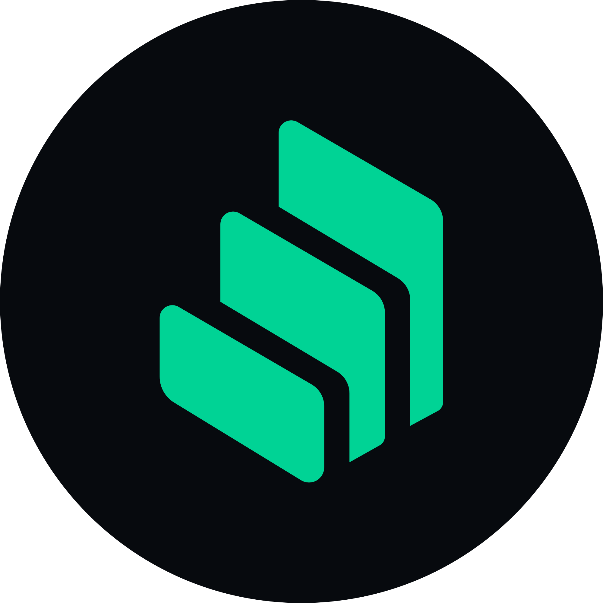

#### Assignment1--04-18
# 
#  **Compound Finance: Revolutionizing Decentralized Lending** 

## **Overview and Origin**

* **Name of company:**

     * **Compound Finance***

* **When was the company incorporated?**

     *Compound Finance was incorporated in **2017***

* **Who are the founders of the company?**

     *Compound Finance was founded by **Robert Leshner**.*

* **How did the idea for the company (or project) come about?**

     *  The idea for Compound Finance came from Leshner's desire to create an **open and decentralized protocol for lending and borrowing cryptocurrencies**.*

 * **How is the company funded? How much funding have they received?**
        
     *  Compound Finance has received funding from various sources, including **venture capital firms and cryptocurrency investors**.The total funding received amounts to **$32 million**.*

## **Business Activities**

* **What specific financial problem is the company or project trying to solve?**
    
     *Compound Finance aims to solve the problem of accessing liquidity and earning interest on digital assets in a decentralized manner. They provide a protocol that allows users to **lend or borrow various cryptocurrencies, earning interest or paying interest on borrowed assets**.*

* **Who is the company's intended customer? Is there any information about the market size of this set of customers?**

     *Compound Finance's intended customers include **cryptocurrency holders and DeFi users who seek to maximize their returns on digital assets by lending them out or borrowing against them**. The market size for these customers has grown rapidly as the DeFi ecosystem continues to expand. ( )*

* **What solution does this company offer that their competitors do not or cannot offer?** 

     * Compound Finance offers a decentralized lending and borrowing protocol that allows users to lend their cryptocurrencies and earn interest, as well as borrow assets using their crypto holdings as collateral. The protocol ensures **transparency, security, and accessibility, setting it apart from traditional centralized lending platforms**.*

* **Which technologies are they currently using, and how are they implementing them?** 

     * Compound Finance is **built on the Ethereum blockchain and utilizes smart contracts to enable the lending and borrowing functionalities**. The protocol leverages Ethereum's solidity programming language and **interacts with users through web interfaces and mobile applications**.*

## **Landscape**
* **What domain of the financial industry is the company in?**

     * Compound Finance operates in the domain of **Lending and Cryptocurrencies***

* **What have been the major trends and innovations of this domain over the last 5-10 years?**

     * Over the last 5-10 years, Cryptocurrencies, and the DeFi domain has witnessed significant growth and innovation. **The emergence of blockchain technology, smart contracts, and decentralized applications has enabled the creation of various financial services, including lending, borrowing, decentralized exchanges, and yield farming**.*

* **What are the other major companies in this domain?**

     * Some other major companies in the DeFi lending and borrowing space include **Aave, MakerDAO, and Synthetix**.*

## **Results**
* **What has been the business impact of this company so far?**

     * Compound Finance has had a significant impact on the DeFi landscape, providing users with a decentralized alternative to traditional lending platforms. **It has facilitated billions of dollars worth of loans and has attracted a large user base, contributing to the growth and adoption of DeFi as a whole.***

* **What are some of the core metrics that companies in this domain use to measure success?How is your company performing, based on these metrics?**

     * Key metrics for DeFi lending protocols include **the total value locked (TVL), user activity, borrowing volume, and interest rates**.  Compound Finance has consistently ranked among the top protocols in terms of TVL, reflecting the trust and usage of the platform by the DeFi community.*

* **How is your company performing relative to competitors in the same domain?**
    
     * Compound Finance has been a major player in the DeFi lending and borrowing domain, competing with other notable protocols like Aave and MakerDAO. **The company's performance relative to its competitors depends on various factors, including user adoption, TVL, and market share.***

## **Recommendations**

* **If you were to advise the company, what products or services would you suggest they offer?**

     * Compound Finance could explore expanding its services to **include additional cryptocurrencies for lending and borrowing, broaden the range of collateral assets accepted, or introduce new features such as decentralized derivatives trading**.*

* **Why do you think that offering this product or service would benefit the company?**

     * Offering new products or services would **attract a broader user base and provide more opportunities for revenue generation**. It would also help to differentiate Compound Finance from competitors and strengthen its position as a leading DeFi protocol..*

* **What technologies would this additional product or service utilize?**

     * Additional products or services could utilize technologies such as **cross-chain interoperability protocols, decentralized oracle networks for reliable price feeds, and innovative smart contract architectures.**.*

* **Why are these technologies appropriate for your solution?**

     * These technologies would **enhance the versatility, scalability, and security of Compound Finance's offerings, enabling seamless integration with other blockchain networks, accurate market data, and robust contract execution.*** 

    
    
    
    # References

1. Compound Finance Website:[https://compound.finance/](https://compound.finance/)

2. Compound Finance whitepaper:[https://compound.finance/](https://compound.finance/documents/Compound.Whitepaper.pdf)

3. CoinDesk: [https://www.coindesk.com/](https://www.coindesk.com/)

4. CoinTelegraph: [https://cointelegraph.com/](https://cointelegraph.com/)

5. Decrypt: [https://decrypt.co/](https://decrypt.co/)
